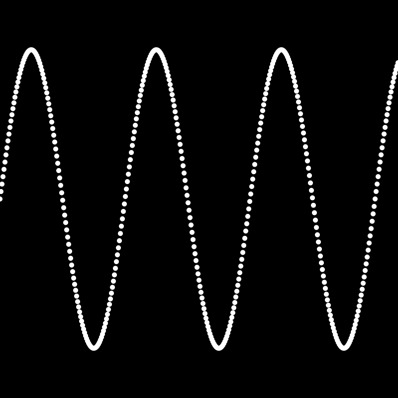

# Simple Sine wave rendering

### Use parametric equation

#### f(x) = t
#### f(y) = sin(t)
Note:: Sine Wave -> Amplitude * sin(t * frequency) \
In Computers positive y in downwards -> __-__ Amplitude * sin(t * frequency)

